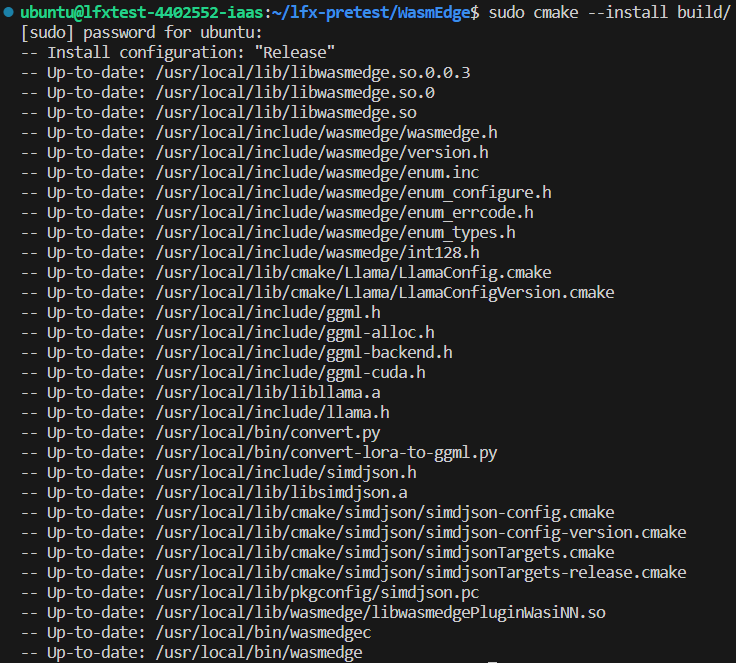

# LFX PRETEST / Intel-Extension-For-Transformers
ZHANYI LIN
## SYSTEM SPEC
```bash
uname -a
```


```bash
lscpu
```


```bash
nvidia-smi
```


## FRAMEWORK / Intel-Extension-For-Transformers
### 0. DEPENDENCY
Since Intel oneAPI2024 base toolkit remove the libmkl_sycl.so.3(need by intel-extension-for-transformers), so I install an additional older version.
```bash
wget https://registrationcenter-download.intel.com/akdlm/irc_nas/19079/l_BaseKit_p_2023.0.0.25537.sh
sudo sh ./l_BaseKit_p_2023.0.0.25537.sh
source /opt/intel/2024/setvars.sh # 2024 oneAPI-base kit
source /opt/intel/oneapi/2022/mkl/latest/env/vars.sh # 2023 oneAPI-mkl
```

### 1. BUILD
Build from source, managing environments by miniconda.
```bash
git clone https://github.com/intel/intel-extension-for-transformers.git itrex
cd itrex
git checkout v1.3

# conda setup
conda activate lfx
# add datasets==2.14.6 transformers==4.34.0 torch==2.0.0+cpu to requirements.txt
pip install -r requirements.txt
pip install -v .
```

### 2. Example
- Language-modeling quantization example
    - Depends on pytorch
    - Model: EleutherAI/gpt-neo-125M from transformers
    - Dataset: wikitext-2-raw-v1 from dataset
- CPU only
    - My GPU are not Intel GPU so I only test the CPU version.
```bash
cd examples/huggingface/pytorch/language-modeling/quantization
pip install -r requirements.txt

# add verification_mode='no_checks' to line 312 to avoid warning with batch size
python run_clm.py \
    --model_name_or_path EleutherAI/gpt-neo-125M \
    --dataset_name wikitext \
    --dataset_config_name wikitext-2-raw-v1 \
    --tune \
    --quantization_approach PostTrainingStatic \
    --do_train \
    --do_eval \
    --output_dir `pwd` \
    --overwrite_output_dir
```


## WASMEDGE / WASI-NN llama.cpp Backend
### 0. DEPENDENCY
- LLVM needs to be install by cmake to generate cmake file which need by WASI-NN
- Enable LLD in LLVM build which also need by WASI-NN
```bash
# llvm
git clone https://github.com/llvm/llvm-project
cd llvm-project
git checkout release/14.x
cd llvm

cmake -GNinja -Bbuild -DCMAKE_BUILD_TYPE=Release \
    -DLLVM_ENABLE_PROJECTS=lld \
    -DCMAKE_INSTALL_PREFIX=/opt/llvm \
    .
    
cmake --build build
sudo cmake --install build 
```

### 1. BUILD
- Build from source
- Enable CUDA plugin, since my system have 2 V100 GPU
```bash
cd ~/
mkdir -p lfx-pretest
cd lfx-pretest
git clone https://github.com/WasmEdge/WasmEdge.git
cd WasmEdge
git checkout hydai/0.13.5_ggml_lts

export CXXFLAGS="-Wno-error"
export CUDAARCHS="70"

rm -fr build 

# With CUDA
cmake -GNinja -Bbuild -DCMAKE_BUILD_TYPE=Release \
    -DCMAKE_CUDA_ARCHITECTURES="70" \
    -DCMAKE_CUDA_COMPILER=`which nvcc` \
    -DWASMEDGE_PLUGIN_WASI_NN_BACKEND="GGML" \
    -DWASMEDGE_PLUGIN_WASI_NN_GGML_LLAMA_BLAS=OFF \
    -DWASMEDGE_PLUGIN_WASI_NN_GGML_LLAMA_CUBLAS=ON \
    -DLLVM_DIR=/opt/llvm/lib/cmake/llvm \
    -DLLD_DIR=/opt/llvm/lib/cmake/lld \
    .

cmake --build build
sudo cmake --install build 
```


### 2. Create an OpenAI compatible API server for your LLM
In my implementation, I choose the GGUF format llama2 7b chat model.
#### Run the API server via curl
```bash
cd ~/lfx-pretest

curl -LO https://github.com/second-state/LlamaEdge/releases/latest/download/llama-api-server.wasm
curl -LO https://huggingface.co/second-state/Llama-2-7B-Chat-GGUF/resolve/main/Llama-2-7b-chat-hf-Q5_K_M.gguf

wasmedge --dir .:. \
--nn-preload default:GGML:AUTO:Llama-2-7b-chat-hf-Q5_K_M.gguf llama-api-server.wasm \
-p llama-2-chat 
```


#### Test the API server via terminal
```bash
curl -X POST http://127.0.0.1:8080/v1/completions \
    -H 'accept:application/json' \
    -H 'Content-Type: application/json' \
    -d '{"prompt":["Long long ago, "], "model":"tinyllama"}'
```


#### Web UI
```bash
curl -LO https://github.com/second-state/chatbot-ui/releases/latest/download/chatbot-ui.tar.gz
tar xzf chatbot-ui.tar.gz

wasmedge --dir .:. \
--nn-preload default:GGML:AUTO:Llama-2-7b-chat-hf-Q5_K_M.gguf llama-api-server.wasm \
-p llama-2-chat 
```


#### Other Testing
Testing with prompt
```bash
cd ~/lfx-pretest

wasmedge --dir .:. \
    --nn-preload default:GGML:AUTO:Llama-2-7b-chat-hf-Q5_K_M.gguf \
    --env enable-log=true \
    --env stream-stdout=true \
    --env ctx-size=4096 \
    --env n-predict=1024 \
    --env n-gpu-layers=100 \
    wasmedge-ggml-llama.wasm \
    default \
    '[INST] <<SYS>>\nYou are a helpful, respectful and honest assistant. Always answer as helpfully as possible, while being safe.  Your answers should not include any harmful, unethical, racist, sexist, toxic, dangerous, or illegal content. Please ensure that your responses are socially unbiased and positive in nature. If a question does not make any sense, or is not factually coherent, explain why instead of answering something not correct. If you do not know the answer to a question, please do not share false information.\n<</SYS>>\nWhat is the capital of Japan?[/INST]'
```
